# OnlineProjectPlanner Manual (For New Users)

This manual explains how to use every visible part of the application with example data.

Example data used in this guide:
- **Team:** `Manual Team`
- **Project:** `Website Launch Plan`
- **Gantt task:** `Planning & Discovery`
- **User:** `manual_user`

---

## 1) Sign in page (Login + Join Team)

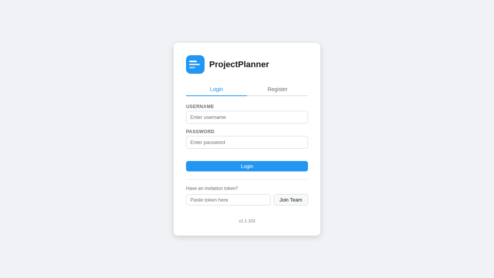

Use these elements:
- **Login tab**: opens the sign-in form.
- **Username / Password**: your account credentials.
- **Login button**: signs in and opens `app.html`.
- **Invitation token field + Join Team**: paste a team invite token to join an existing team.
- **Version number**: shown at the bottom.

---

## 2) Register page

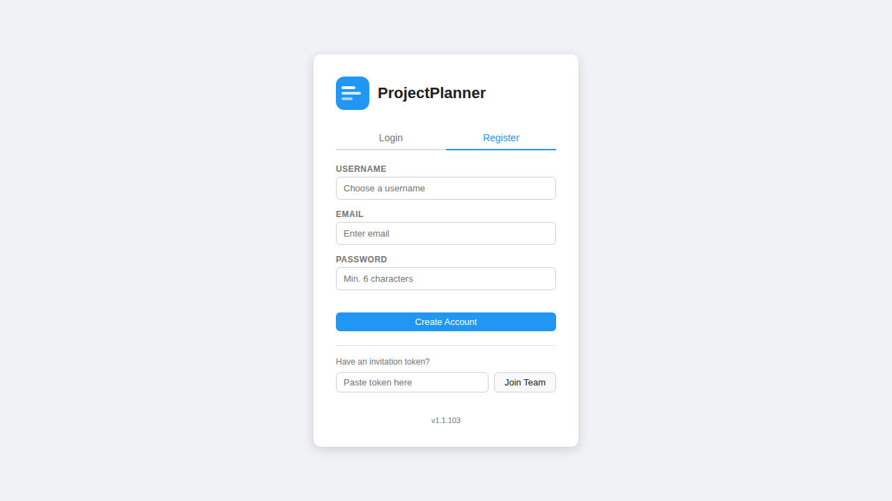

Use these elements:
- **Register tab**: opens account creation form.
- **Username / Email / Password**: required for first-time setup.
- **Create Account**: creates your account and signs you in.

---

## 3) Create your first team

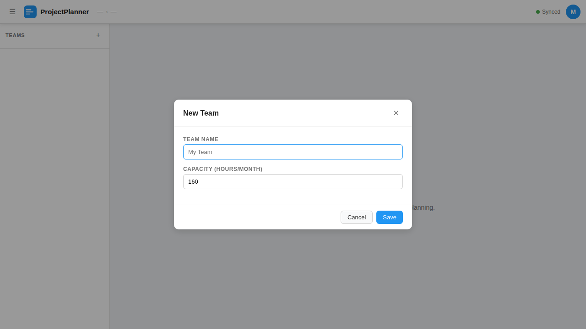

Use these elements:
- **Team Name**: display name for your team.
- **Capacity (hours/month)**: used for workload intensity visualization in Gantt.
- **Save**: creates the team.

---

## 4) Create your first project

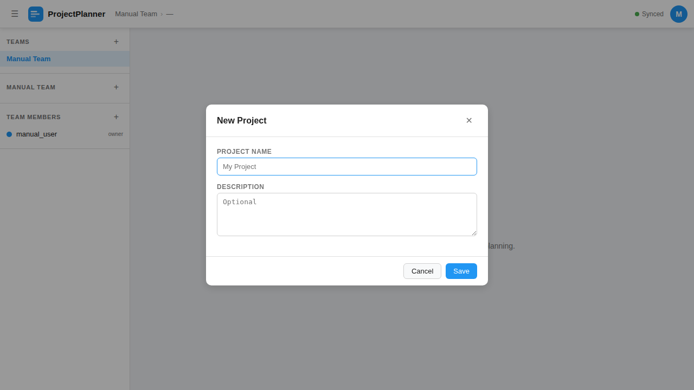

Use these elements:
- **Project Name**: required.
- **Description**: optional context.
- **Save**: creates and opens the project.

---

## 5) Main app layout overview

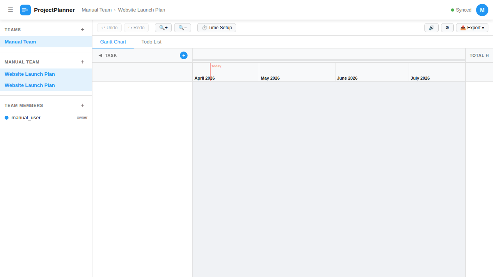

Main areas and what they do:
- **Top bar**: sidebar toggle, team/project breadcrumb, sync status, user avatar.
- **Sidebar**:
  - **Teams (+)**: create/select team.
  - **Projects (+)**: create/select project in selected team.
  - **Team Members (+)**: invite members.
- **Toolbar**: undo/redo, zoom, time setup, sounds, settings, export.
- **View tabs**: switch between **Gantt Chart** and **Todo List**.

---

## 6) Add a Gantt task

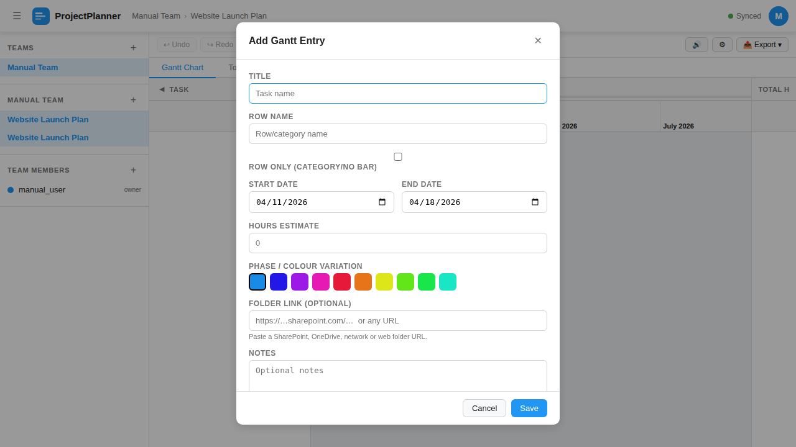

Use these elements:
- **Title**: task name.
- **Row name**: visual row label.
- **Row only**: creates a category row (no bar) when enabled.
- **Start Date / End Date**: schedule window.
- **Hours Estimate**: planned effort.
- **Phase / Colour Variation**: visual phase color.
- **Folder Link**: SharePoint/URL shortcut.
- **Notes**: free text details.

After saving, you can also add the task to Todo.

---

## 7) Gantt view with real data

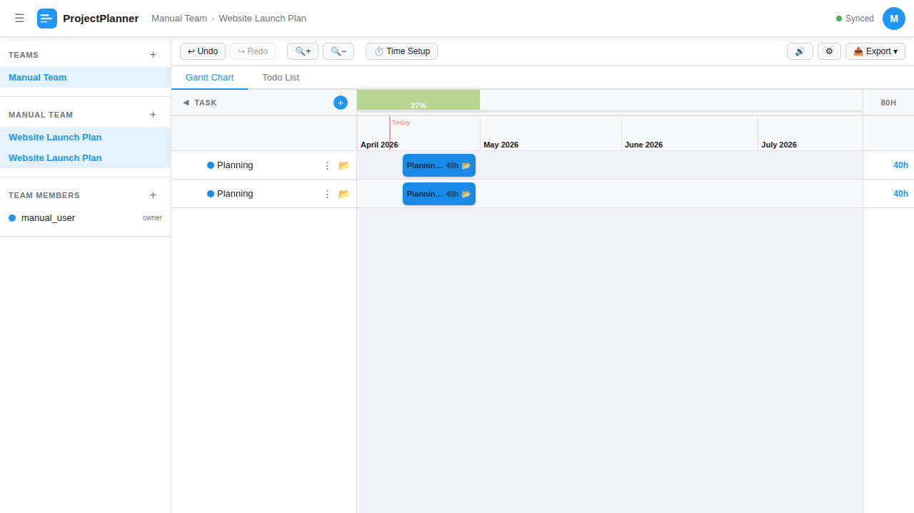

Use these elements:
- **Task list column** (left): task names, row handles, folder shortcut.
- **Timeline bars** (center): drag body to move, drag edges to resize.
- **Dependency nodes** on each bar:
  - left node = input target
  - right node = output source
- **Intensity bar** (top): compares scheduled load vs capacity.
- **Total hours column** (right): task totals.
- **Undo / Redo** (toolbar): revert/restore changes.
- **Zoom in / Zoom out**: change timeline density.

---

## 8) Time Setup dropdown

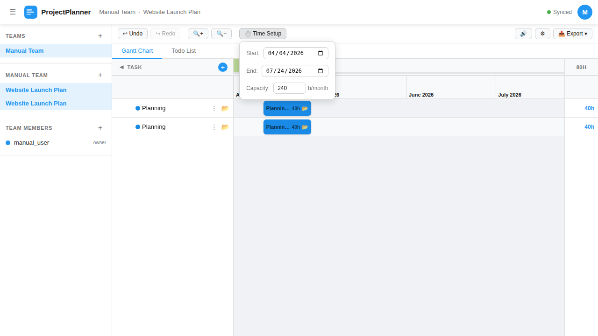

Use these elements:
- **Start**: chart start date.
- **End**: chart end date.
- **Capacity (h/month)**: team capacity used by intensity bar.

---

## 9) Settings dropdown

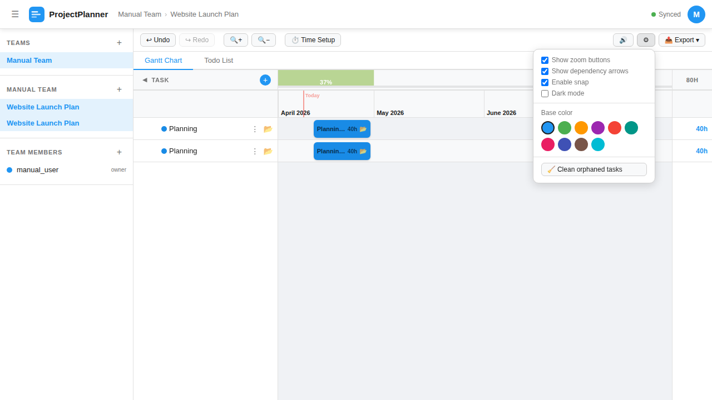

Use these elements:
- **Show zoom buttons** toggle.
- **Show dependency arrows** toggle.
- **Enable snap** toggle.
- **Dark mode** toggle.
- **Base color palette** for your user color theme.
- **Clean orphaned tasks** utility button.

---

## 10) Export dropdown

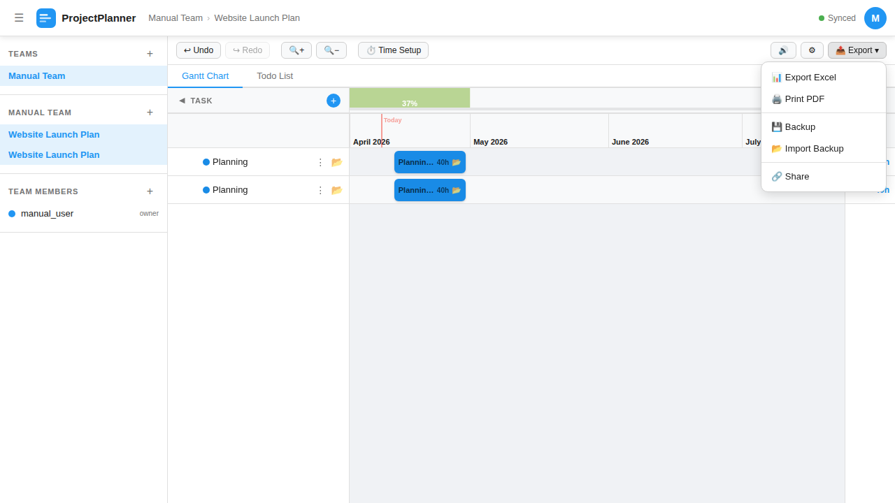

Use these elements:
- **Export Excel**: export project plan data for spreadsheet use.
- **Print PDF**: print/save project as PDF.
- **Backup**: download JSON backup.
- **Import Backup**: restore from backup JSON.
- **Share**: generate/revoke read-only public link.

---

## 11) Share modal (before link)

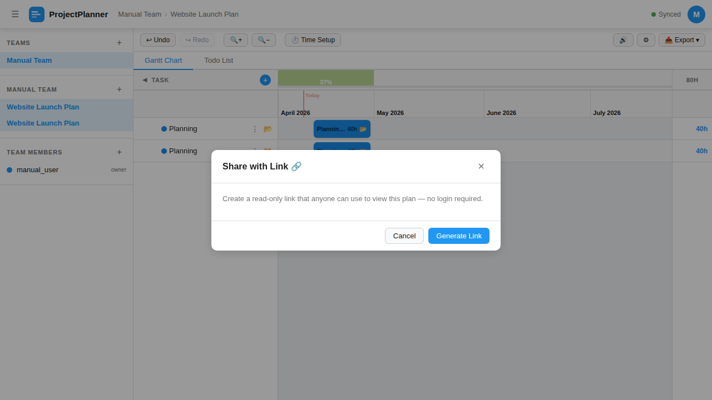

Use these elements:
- **Generate Link**: creates a public read-only URL.
- **Cancel**: close without changes.

## 12) Share modal (after link)

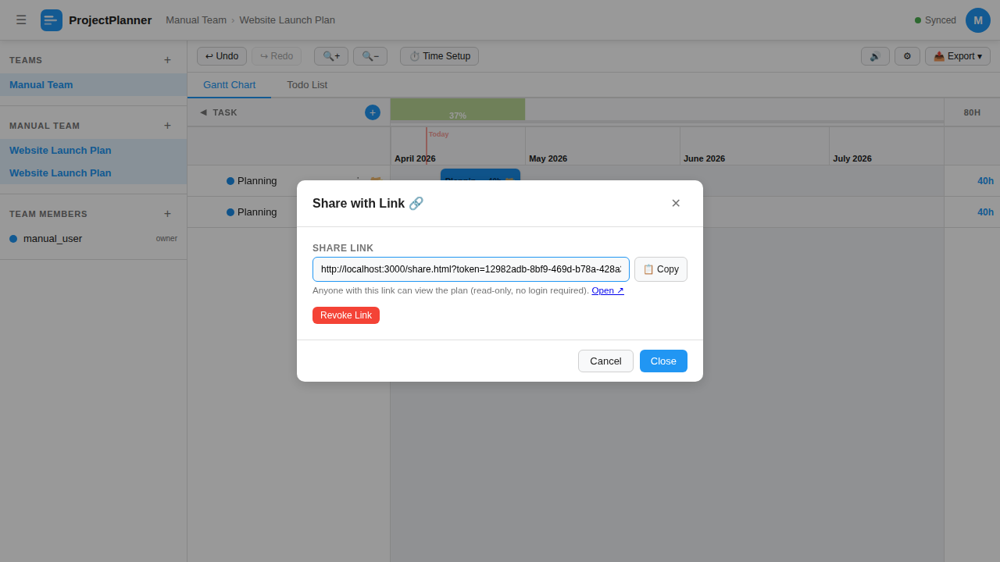

Use these elements:
- **Share Link field**: current public URL.
- **Copy**: copy URL to clipboard.
- **Open ↗**: open read-only page in new tab.
- **Revoke Link**: immediately disables shared access.

---

## 13) Todo board with linked tasks

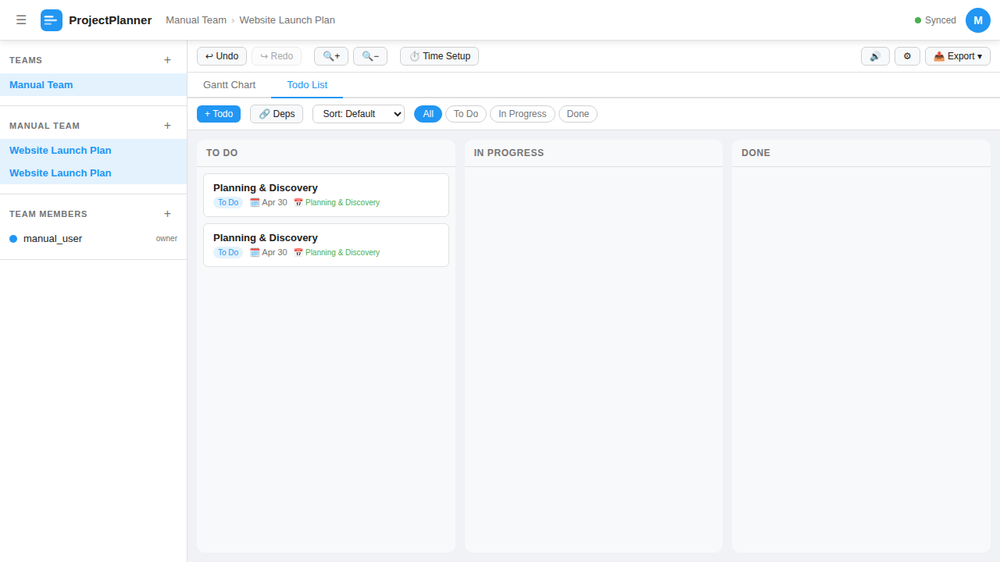

Use these elements:
- **+ Todo**: create a card.
- **Deps**: show/hide dependency indicators.
- **Sort dropdown**: default/priority/due date/A–Z.
- **Status filters**: All / To Do / In Progress / Done.
- **Columns**: drag cards between columns to change status.
- **Card metadata**: status badge, due date, linked Gantt task.

---

## 14) Add Todo modal

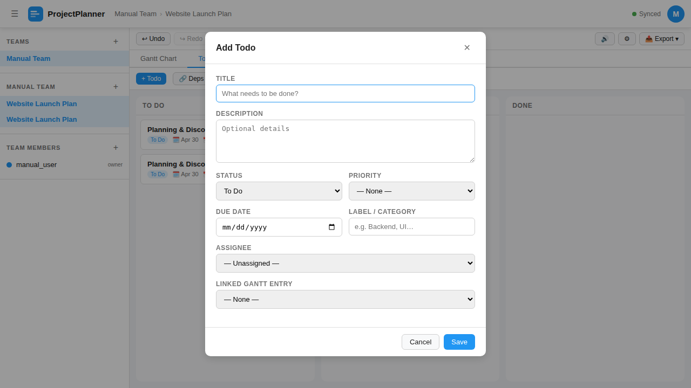

Use these elements:
- **Title / Description**
- **Status / Priority**
- **Due Date / Label**
- **Assignee** (team member)
- **Linked Gantt Entry**
- **Save** to create todo card

---

## 15) User panel (account menu)

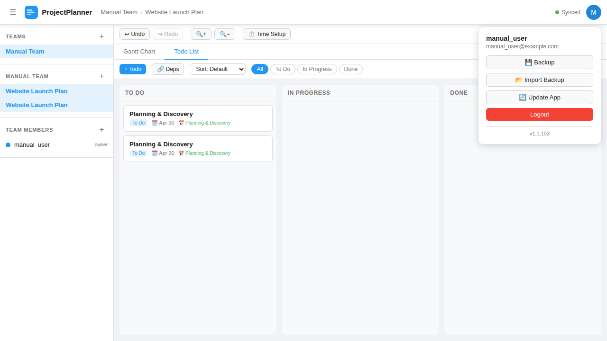

Use these elements:
- **Backup**
- **Import Backup**
- **Update App**
- **Logout**
- **Version display**

---

## 16) Read-only shared project page (`share.html`)

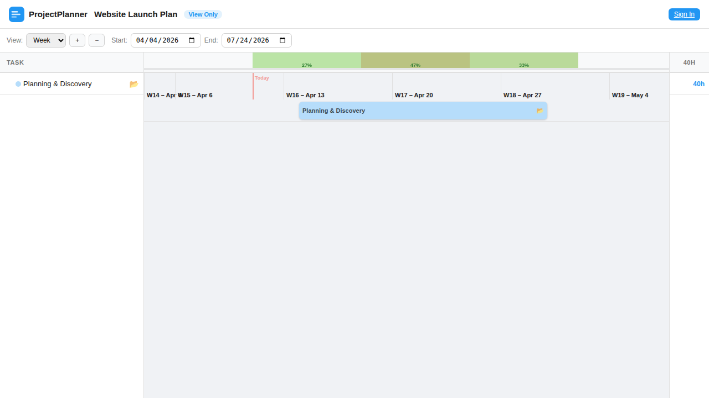

This page is for external viewers (no login required).

Use these elements:
- **View scale**: Day / Week / Month.
- **Zoom + / −**.
- **Start / End date filters**.
- **Task list and timeline bars** (read-only).
- **Folder links** (if present).
- **Sign In** button to return to full app.

---

## 17) Typical first-day workflow (recommended)

1. Register account.
2. Create a team.
3. Create a project.
4. Add top-level Gantt tasks with dates/hours.
5. Link related tasks with dependencies.
6. Add matching Todo cards for execution tracking.
7. Set chart range + team capacity in Time Setup.
8. Export or share when needed.
9. Backup regularly.

---

## 18) Keyboard and interaction shortcuts

- **Undo:** `Ctrl + Z`
- **Redo:** `Ctrl + Y`
- **Add Gantt task:** `N`
- **Zoom:** `+` and `−` buttons
- **Drag interactions:**
  - drag bar body = move task
  - drag bar edge = resize task
  - drag todo card between columns = change status

